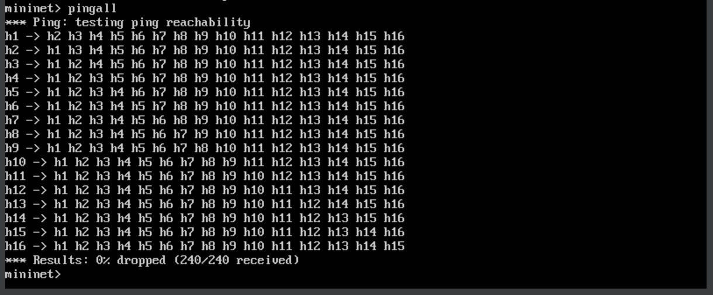

# C115-L1_Mininet_Homework
Repository for my learning homework for Mininet tool for C115 subject

## Contents

- [Proposal](#proposal)
- [Acivity Execution](#activity-execution)
  - [1- Login in to Mininet Virtual Machine](#1--login-in-to-mininet-virtual-machine)
  - [2- Creating the Topology](#2--creating-the-topology)
  - [3- Inspecting Topology Informations](#3--inspecting-topology-informations)
    - [Topology Nodes](#topology-nodes)
    - [Topology Net](#topology-net)
    - [Logical Ports Adresses](#logical-ports-adresses)
    - [Hosts Data](#hosts-data)
  - [4- Ping Test for all Nodes](#4--ping-test-for-all-nodes)
  - [5- Server-Clinet Test](#5--server-client-test)
    - [Setting Up Putty Connection](#setting-up-putty-connection)
    - [Login to Mininet through Putty](#login-to-mininet-through-putty)
    - [Opening Host1 and Host2 Terminals](#opening-host1-and-host2-terminals)
    - [Setting Host1 as Server and Host2 as Client](#setting-host1-as-server-and-host2-as-client)


## Proposal

The following text describes the proposal for this activity:

``` text
Considere uma topologia tree com profundidade (depth=4) e ramificação (fanout=2).
  - Com uso de linha de comando padrão do Mininet, crie a topologia considerando o endereço MAC padronizado, larguras de banda bw de 25Mbps e controlador do Mininet (não precisa especificar);
  - Inspecione informações das interfaces, endereços MAC, IP e portas através de linhas de comando;
  - Execute testes de ping entre os diferentes nós.
  - Especifique que o host 1 na porta 5555 vai ser um servidor TCP e o host 2 um cliente e execute testes de iperf, considere um relatório por segundo com teste de 10 segundos. Faça os testes para larguras de banda bw de 25 Mbps
```

## Activity Execution

### 1- Login in to Mininet Virtual Machine


---

### 2- Creating the Topology


---

### 3- Inspecting Topology Informations

#### Topology Nodes


---

#### Topology Net


---

#### Logical Ports Adresses


---

#### Hosts Data


---

### 4- Ping Test for all Nodes



---

### 5- Server-Client Test

#### Setting Up Putty Connection


---

#### Login to Mininet Through Putty


---

#### Recreating Topology


---

#### Opening Host1 and Host2 Terminals


---

#### Setting Host1 as Server and Host2 as Client


